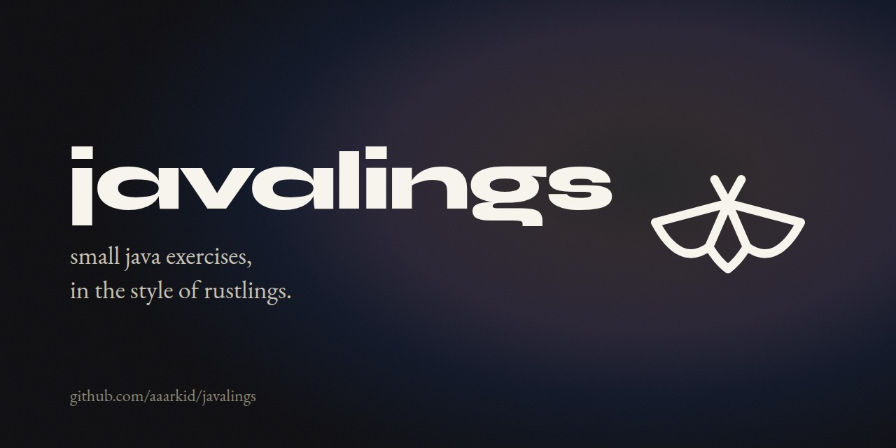

  

Java exercises in the style of [Rustlings](https://github.com/rust-lang/rustlings).
I made these for my cousin, who knows some Python and wants to learn Java. The
comments assume that: they say what is different from Python and skip what is
the same.

Each exercise is a Java file that is broken in some way. It does not compile,
or it runs and gives the wrong answer. You fix it, the runner checks it, you go
to the next one. The early chapters are about the language. The last two are
algorithms and programs split across several files.

## Setup

You need a JDK, version 17 or newer. Check with:

    java -version

If that prints a version, you are ready. If not, install one, for example from
https://adoptium.net. Any editor works. VS Code with the "Extension Pack for
Java" is a good choice.

Then:

    git clone https://github.com/aaarkid/javalings.git
    cd javalings

## Doing the exercises

    java Javalings.java list          # every exercise, done or not
    java Javalings.java next          # run the first exercise that is not done
    java Javalings.java run intro2    # run one exercise by name
    java Javalings.java hint intro2   # a hint for it
    java Javalings.java watch         # re-run whenever you save

Every exercise file starts with a comment that explains the task, and a line
`// I AM NOT DONE`. Fix the code. When it passes, delete that line and the
runner moves on.

`watch` is the way I would do it: exercise open in the editor, terminal next
to it, save and look.

  

## Chapters

| Chapter | What it covers |
|---|---|
| 00_intro | running the exercises |
| 01_variables | types, `final` |
| 02_methods | parameters, return values |
| 03_if | `if`, `else if`, `switch` |
| 04_primitive_types | `int` vs `double`, `long`, `char`, casting |
| 05_strings | String methods, StringBuilder, split and join |
| 06_arrays | fixed-size arrays, 2D arrays |
| 07_loops | `for`, `while`, `break`, `continue`, nested loops |
| 08_classes | fields, constructors, `private`, `toString`, `equals`, `static` |
| 09_enums | enums with data |
| 10_collections | ArrayList, HashMap, HashSet, sorting with Comparator |
| 11_exceptions | try / catch, throwing, checked exceptions |
| 12_inheritance | `extends`, `abstract`, interfaces |
| 13_generics | generic methods and classes |
| 14_lambdas_streams | records, lambdas, streams |
| 15_recursion | base cases, memoization |
| 16_algorithms | binary search, insertion and merge sort, hashing, stacks, BFS |
| 17_projects | packages, multi-file programs, interfaces across files, file IO |

The projects in chapter 17 are folders instead of single files. Each has a
README with the task, and the `I AM NOT DONE` line lives in that README.

## Solutions

`solutions/` has one answer per exercise. Try for a while before you look.
`scripts/check_solutions.sh` runs the whole set against the solutions.
